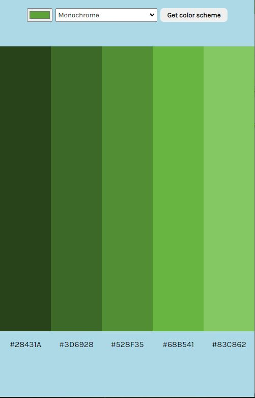

# Color Scheme Generator - Solo project on Scrimba Frontend Career Path

A simple color scheme generator that allows you to search, discover, test and create beautiful color palettes for your projects. It uses an API called [The Color API](https://www.thecolorapi.com/) and it's been made as Solo project on [Frontend Career Path](https://scrimba.com/learn/frontend). Based on user inputs, Color API will generate a color scheme for the user.

## Table of contents

- [Overview](#overview)
  - [Screenshot](#screenshot)
  - [Links](#links)
- [Process](#process)
  - [Built with](#built-with)
- [Author](#author)

## Overview

Users are allowed to: 
- select the color from the color pallette 
- select generating mode, out of monochrome, analogic, complement and many more
- click on one of the five colors generated to copy its hex value to the clipboard

### Screenshot

### Links

- Live Site URL: [Color Scheme Generator](https://jelenkoo10.github.io/color_scheme_generator/)

## Process

### Built with

- Asynchronous JavaScript
- Semantic HTML5 markup
- Flexbox

## Author

- GitHub - [https://github.com/jelenkoo10](https://github.com/jelenkoo10)
- Frontend Mentor - [@jelenkoo10](https://www.frontendmentor.io/profile/jelenkoo10)

